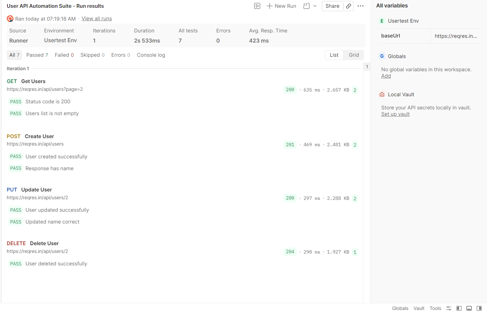

# API Test Automation - Postman

## 📌 Project Overview

This project demonstrates API testing and automation using Postman for a user management system. It covers CRUD operations and validates responses using automated test scripts.

## 🌐 API Used

* Base URL: https://reqres.in/api
* API: ReqRes (mock REST API for testing)

## 🔐 Authentication

* API Key used via header: `x-api-key`
* Managed using Postman environment variables

## 🚀 Features

* Automated API testing for:

  * GET (Retrieve users)
  * POST (Create user)
  * PUT (Update user)
  * DELETE (Delete user)
* Response validation using JavaScript (Postman scripts)
* Collection Runner execution
* Environment variable usage

## ▶️ How to Run

1. Import the collection JSON file into Postman
2. Import the environment JSON
3. Select the environment
4. Add your API key in `api_key`
5. Run using Collection Runner

## 🛠 Tools

* Postman
* ReqRes API

## 📸 Collection Runner Result

## 👤 Author

Vishwani Punchihewa
